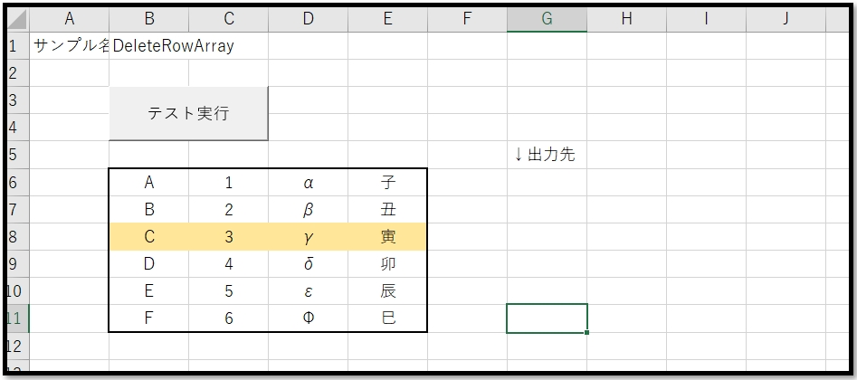
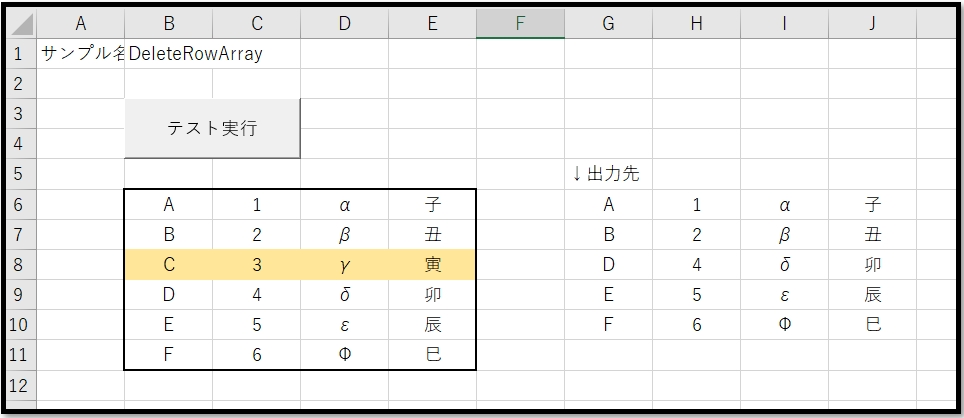

# VBA-DeleteRowArray
- License: The MIT license

- Copyright (c) 2021 YujiFukami

- 開発テスト環境 Excel: Microsoft® Excel® 2019 32bit 

- 開発テスト環境 OS: Windows 10 Pro

実行環境など報告していただくと感謝感激雨霰。

# 説明
二次元配列の指定行を消去した配列を出力する

## 活用例
なし

# 使い方
実行サンプル「Sample-DeleteRowArray.xlsm」の中の使い方は以下の通り。

中身

「テスト実行」ボタンを押した後

## 設定
実行サンプル「Sample-DeleteRowArray.xlsm」の中の設定は以下の通り。

### 設定1（使用モジュール）

-  ModTest.bas
-  ModDeleteRowArray.bas

### 設定2（参照ライブラリ）
なし

